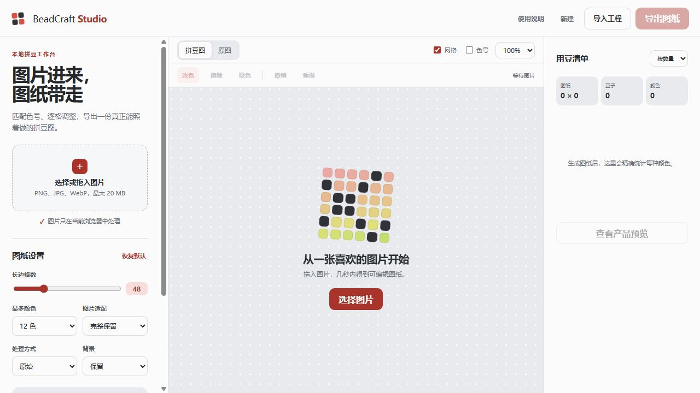

# BeadCraft Studio / 拼豆工坊

一个浏览器本地运行的拼豆图纸编辑器。上传图片后，它会保持原始比例缩放、匹配可用色卡、生成精确二维网格，并让你逐格修正后导出图纸和备料清单。



## 功能

- 本地读取 PNG、JPG、WebP，不上传原图
- 8-160 格可调长边，支持 Contain / Cover
- 原始、增强对比、柔和、卡通近似四种处理方式
- RGB 到 LAB，再用 CIEDE2000 做感知色差匹配
- 最大颜色数限制与精确用豆统计
- 网格、坐标、色号、缩放及原图对比
- 改色、擦除、吸色、同色高亮、批量替换、Undo / Redo
- 导出高清 PNG、真实矢量 SVG、CSV 备料清单和 JSON 工程文件
- 重新导入 JSON 后继续编辑
- 使用同一 grid 本地合成成品、钥匙扣、冰箱贴和桌面立牌预览
- 响应式桌面与移动布局，支持系统深色模式和减少动态效果设置

## 色卡说明

项目内置的是 **MARD 兼容 DEMO 32 色**，不是官方或完整 MARD 色卡，只用于演示色卡接口和编辑流程。正式购买材料前，请以所用品牌的实体色卡校准，并导入来源合法的 CSV 色卡。

CSV 至少需要以下表头：

```csv
code,name,hex
H01,亮白,#F4F2EC
F01,珊瑚红,#E76B61
```

可从 [示例色卡模板](public/demo-palette-template.csv) 开始编辑。

## 本地运行

需要 Node.js 20 或更高版本。

```bash
npm install
npm run dev
```

浏览器打开终端显示的本地地址。

Windows 用户也可以双击桌面的 `BeadCraft Studio` 快捷方式。快捷方式调用 `launch-beadcraft.ps1`，在后台启动本地预览服务并打开浏览器。

## 构建与测试

```bash
npm test
npm run lint
npm run build
```

构建结果输出到 `dist/`。项目是纯静态前端，可以部署到 GitHub Pages 或任何静态托管服务。

## 隐私

第一版没有后端、账号、数据库或分析脚本。图片、颜色匹配、编辑与导出均在当前浏览器中完成。导出的文件只会在用户主动点击后生成。

## 技术栈与结构

- Vite + TypeScript
- 原生 Canvas 与 SVG
- 原生 CSS，无 UI 框架和运行时依赖
- Vitest 单元测试

```text
src/
  core/       图像采样、色彩科学、量化、编辑历史
  canvas/     图纸渲染、文件导出、产品预览
  ui/         应用界面与交互控制
  types/      共享数据结构
tests/        算法、历史、导出与比例测试
docs/         参考分析和界面截图
```

## GitHub Pages

`.github/workflows/deploy.yml` 会在 `main` 分支有新提交时构建并发布网站。首次发布需要在仓库 Settings > Pages 中把 Source 设为 GitHub Actions。没有 GitHub 授权时请查看 [PUBLISH.md](PUBLISH.md)。

## Roadmap

V2：AI 产品摄影效果图、更多品牌色卡、抖动、自动去背景、批量转换、分享链接、PWA、云端保存。

V3：账号系统、社区作品、模板市场、商业订单报价、材料采购清单。

## 参考与致谢

产品流程参考了 MIT 许可的 [EliseSo/pindou-skill](https://github.com/EliseSo/pindou-skill)，尤其是主体比例锁定、图纸优先和同一拼豆对象派生多种产品预览的思路。本项目代码为独立实现，没有复制其生成提示词或脚本。

## License

[MIT](LICENSE)
